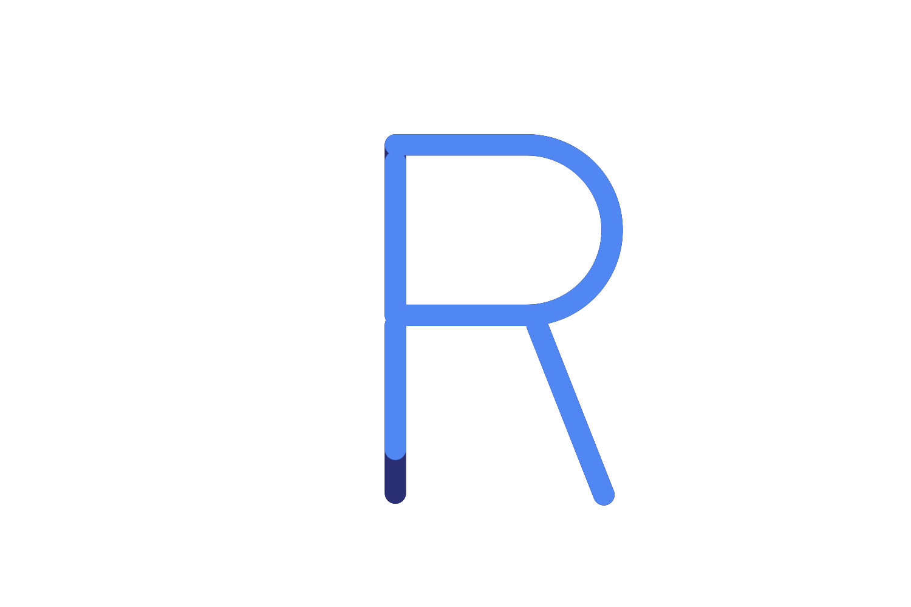

# RUST

- learning rust
- cargo tool
- basic projects
- rust book

---

@codershubinc

# Become Rustic

- Rust is a systems programming language that runs blazingly fast, prevents segfaults, and guarantees thread safety.

     

   
   
  
   
     

